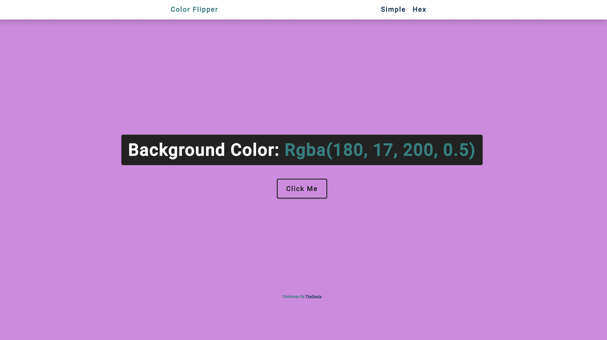

# freeCodeCamp - John Smilga Color Flipper Challenge

This is a solution to the [John Smilga Color Flipper Challenge  on FreeCodeCamp](https://www.youtube.com/redirect?event=video_description&redir_token=QUFFLUhqa0JEajNMRldyX2F5OFVJeGh6dDJZVkN3ZFhnQXxBQ3Jtc0tseURWcVRpTGo2VXpna2JSTEh2TEZFRE5kOTVVYTdLVDRaQ1pkbmJwLUJRLXRDcmpDcVlvMGNmSWlzaVZSeWlqOTJsbWNib2JoblBSOTZhejNaMkUzYmo2UXM1MWdEV1NfSGE3eEJIZ0pPd180RHZ1cw&q=https%3A%2F%2Fgithub.com%2Fjohn-smilga%2Fjavascript-basic-projects&v=3PHXvlpOkf4). 

## Table of contents

- [Overview](#overview)
  - [The challenge](#the-challenge)
  - [Screenshot](#screenshot)
  - [Links](#links)
- [My process](#my-process)
  - [Built with](#built-with)
  - [What I learned](#what-i-learned)
  - [Continued development](#continued-development)
  - [Useful resources](#useful-resources)
- [Author](#author)

## Overview

### The challenge

Users should be able to:

- Click on the button and experience the background color switches from primary colors to Hex colors on their device's screen size

### Screenshot

### Links

- Solution URL: [Solution](https://your-solution-url.com)
- Live Site URL: [Live Site](https://your-live-site-url.com)

## My process

### Built with

- Semantic HTML5 markup
- CSS custom properties
- Flexbox
- CSS Grid
- Mobile-first workflow
- Vanilla JavaScript 

### Continued development

Use this section to outline areas that you want to continue focusing on in future projects. These could be concepts you're still not completely comfortable with or techniques you found useful that you want to refine and perfect.

### Useful resources

- [Vanilla JavaScript Projects](https://www.youtube.com/redirect?event=video_description&redir_token=QUFFLUhqa2hCajcyZFVzNERiZGQ1WmlQVUI4cmVJRjhoQXxBQ3Jtc0trSm82ampQY0R5LVZhMDVkY19ZS1RVc1NvWjVYYlFpZXh1ZXI3SmJEZFFKWnVPVlBkMTlGQXhnUy11alZqVXJSanRnT1ZLZzBMZ1lreUJMQVpPQ3ctRXN5X0JRUm90NmlEUE1IRmpYX0duQnFvS0l6RQ&q=https%3A%2F%2Fwww.vanillajavascriptprojects.com%2F&v=3PHXvlpOkf4)
- [John Smilga's Courses](https://www.youtube.com/codingaddict) 

### Author

- Website - [TheDeola](https://thedeola.netlify.app/)
- Frontend Mentor - [@TheDeola](https://www.frontendmentor.io/profile/yourusername)
- Twitter - [@deolacodes](https://www.twitter.com/deolacodes)
